# Digital Audit of Business Entertainment Expenses - Technical Implementation Report

## Executive Summary

This report outlines the technical implementation framework for digitally auditing business entertainment expenses. By leveraging data analytics, automation, and machine learning algorithms, we aim to enhance the authenticity, completeness, compliance, accuracy, and timeliness of business entertainment expense management.

| **Technical Layer** | **Function** | **Advantages** |
| --- | --- | --- |
| **Data Collection Layer** | Multi-source data collection | Covers 6 major internal and external data sources |
| **Data Cleansing Layer** | Unified format, relationship establishment | Data quality improvement of 90% |
| **Rule Engine Layer** | 200+ audit rules | Automated identification of violations |
| **Intelligent Analysis Layer** | Machine learning + relationship graph + anomaly trend prediction | Discovers hidden risk patterns |
| **Alert Output Layer** | Real-time warning reports | Transforms from post-audit to pre-prevention |


## 1. Data Sources and Collection

### 1.1 Data Categories

- **Financial Data**: Reimbursement detail ledger (amount, time, reimbursement applicant, department, customer, reason)
- **Business Data**: Employee roster (job level, department), reimbursement process logs (application and approval time)
- **External Data**: Invoice verification results obtained through technology, commercial enterprise database information, map API (restaurant location)
- Financial vouchers: Invoices

### 1.2 Business Rule Focus

1. **Authenticity:** Whether the recorded business entertainment expenses actually occurred and were genuinely incurred for company business needs, with no fabricated or personal consumption reimbursements
2. **Completeness:** Whether all business entertainment expenses incurred have been recorded promptly and completely, with no hidden expenses in "petty cash" or other accounts (such as conference fees, travel expenses, costs, etc.)
3. **Compliance:**
    1. **Internal Compliance:** Whether expenditures comply with the company's internal "Business Entertainment Management Regulations" (such as approval processes, budget standards, entertainment standards, etc.)
    2. **External Compliance:** Whether accounting treatment and tax deductions comply with the "Enterprise Income Tax Law" and its implementation regulations (such as the deduction limit of 60% of incurred amount and 5‰ of annual sales revenue)
4. **Accuracy and Valuation:** Expense amounts are recorded accurately and allocated appropriately (e.g., correctly distinguishing between different projects or departments)
5. **Cutoff:** Business entertainment expenses are recorded in the correct accounting period

## 2. Technical Implementation Architecture

### 2.1 Automated Data Collection and Processing

  **Invoice OCR Recognition**: Automatically extract key information from invoices (date, amount, merchant name, tax ID)

  **System Integration**: Connect with ERP, reimbursement systems, and banking systems to automatically synchronize transaction data

  **Data Standardization**: Unify data formats from different sources for subsequent analysis


### 2.2 Rule-Based Compliance Verification

**Invoice Verification**: Extract information and check against rules

**Special Case Compliance Check**:

  - **Policy Red Line Scanning**: Automatically filter for over-limit (per capita meal expenses exceeding 500 RMB), over-budget, consumption at sensitive locations (high-end clubs), consumption during sensitive times (holidays) — amount, location, time
  - **Invoice Compliance Verification**: Batch verify invoice authenticity, consecutive invoice numbers, cross-period invoices through RPA robots or API interfaces — invoice authenticity, format
  - **"Four-Document Consistency" Verification**: Automatically compare reimbursement application forms, invoices, consumption lists, and payment records to check if personnel, time, location, and amount match — process compliance
  - **Rule Engine Configuration**: 200+ audit rules covering scenarios such as over-limit, over-budget, and sensitive consumption — policy requirements

```python
# Sample rule: Check if per capita meal expense exceeds limit
def check_per_capita_limit(amount, attendees, limit=500):
    per_capita = amount / attendees
    if per_capita > limit:
        return {"risk": "high", "message": f"Per capita expense {per_capita} exceeds limit {limit}"}
    return {"risk": "low", "message": "Within limit"}

# Sample rule: Detect split reimbursements
def detect_split_reimbursement(transactions):
    same_day_same_vendor = transactions.groupby(['date', 'vendor', 'employee']).size()
    if same_day_same_vendor.max() > 1:
        return {"risk": "medium", "message": "Multiple transactions detected on same day"}
    return {"risk": "low", "message": "No split detected"}

```

  


### 2.3 Cross-Verification Analysis

- **Cross-Verification**: Correlate with travel records, meeting minutes, and business contracts to verify authenticity

      Combined with invoices or transaction records, or system-recorded information

- **Vendor Concentration Analysis**: Track the frequency with which individual reimbursement applicants visit specific restaurants, calculating consumption frequency and concentration to identify abnormal patterns. Abnormal concentration may indicate fabricated transactions or benefit transfers
    
  

    
- **Relationship Network Analysis**: Construct a three-dimensional relationship network graph of "employee-entertainment target-restaurant" and use graph analysis algorithms to discover:

      Patterns of multiple employees frequently entertaining the same "client"

      Associations between employees and restaurant operators

      Cross-verification through commercial enterprise database information

### 2.4 Machine Learning and Advanced Analytics

- **Machine Learning Algorithms**: Identify abnormal patterns and construct relationship graphs

      Feature Correlation Analysis: Detect strong correlations between different features

  


- **Multi-Dimensional Anomaly Pattern Recognition Model & Intelligent Warning System**:
- Four-dimensional analysis: longitudinal, horizontal, relationship network, and behavior pattern
- Real-time generation of risk warning reports, classified and pushed by risk level

      Time dimension trend analysis

      Personnel and team dimensions

      Business dimensions

- **Longitudinal Comparison**: Analyze sudden changes in monthly/quarterly entertainment expenses by department or individual (e.g., year-end surges)
- **Horizontal Comparison**: Calculate per capita or per account consumption, comparing differences across departments and business teams
- **Behavior Pattern Analysis**:
      Split Reimbursement Identification: Consecutive consumption by the same reimbursement applicant at the same restaurant on the same day
      Periodic Consumption Identification: Discover consumption patterns at fixed times and locations. For example, fixed consumption at a certain restaurant every Friday (possibly personal entertainment)
      Delayed Reimbursement Analysis: Records reimbursed long after consumption
      Common Entertainment Business Analysis

## 3. Visualization and Reporting

### 3.1 Trend Analysis Chart Example

Display monthly entertainment expense trends over the past 12 months, marking abnormal peak points:

```mermaid
graph LR
    A["January<br/>80K"] --> B["February<br/>70K"]
    B --> C["March<br/>90K"]
    C --> D["April<br/>85K"]
    D --> E["May<br/>100K"]
    E --> F["June<br/>120K⚠️"]
    F --> G["July<br/>90K"]
    G --> H["August<br/>80K"]
    H --> I["September<br/>110K"]
    I --> J["October<br/>95K"]
    J --> K["November<br/>130K⚠️"]
    K --> L["December<br/>180K⚠️⚠️"]
    
    style F fill:#FFB6C1
    style K fill:#FFB6C1
    style L fill:#FF6B6B

```



### 3.2 Department Horizontal Comparison

| **Department** | **Per Capita Monthly Entertainment Expense** | **Comparison with Average** | **Risk Level** |
| --- | --- | --- | --- |
| Sales Department A | 2,800 RMB | +180% | 🔴 High Risk |
| Sales Department B | 1,500 RMB | +50% | 🟡 Medium Risk |
| Marketing Department | 1,200 RMB | +20% | 🟢 Normal |
| R&D Department | 300 RMB | -70% | 🟢 Normal |
| Average Level | 1,000 RMB | - | - |

### 3.3 Risk Score Radar Chart

Assess risk levels across dimensions including authenticity, compliance, completeness, accuracy, and timeliness:

Based on impact amount, impact level, policy control level, etc.


## 4. Conclusion

By implementing this digital audit framework, organizations can transform business entertainment expense management from reactive review to proactive monitoring and prevention. The combination of automation, data analytics, and machine learning provides comprehensive oversight while reducing manual workload and enhancing financial control effectiveness.
